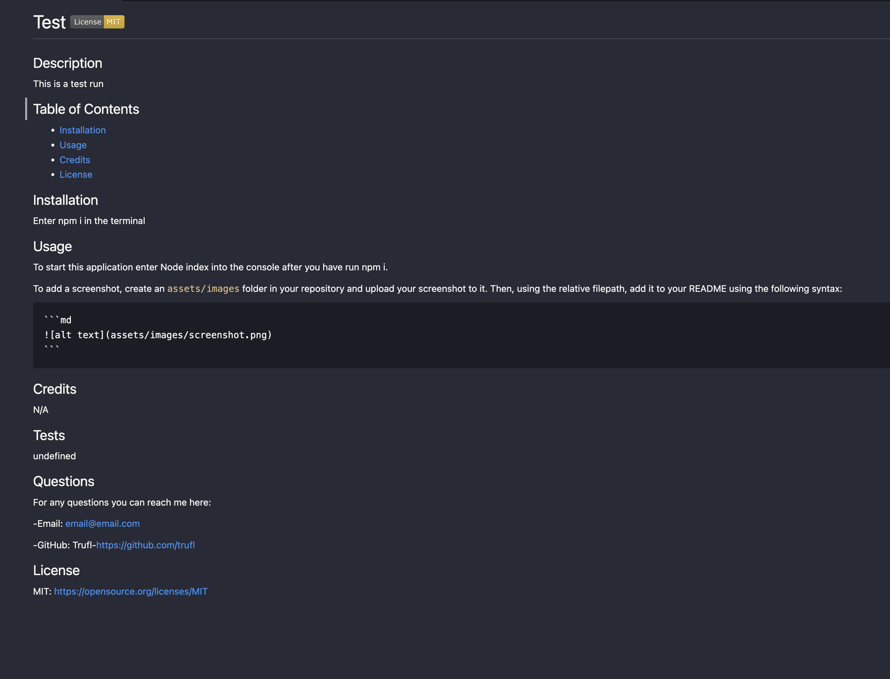

# README File Generator  

## Description

This was the ninth challenge in our bootcamp. It is desgined to test us on what we had learned that week: 

- Using inquire to ask the user a series of prompts 
- Creating new files and writing to them using the filesystem in JS 
- Using promises to run code when we want it to run

## Table of Contents

- [Installation](#installation)
- [Usage](#usage)
- [Credits](#credits)
- [Tests](#tests)
- [Questions](#questions)
- [License](#license)

## Installation

To instal the required node modules, enter the command npm i

## Usage

After you have installed the required node modules as described above, enter the command Node index into the terminal. Then there will be a welcoming message describing the app and a prompt asking you if you would like to start generating a new README. If you press enter the program will start and a series of questions will be asked. If you enter n the console will be cleared and instructiosn for how to end the progrm will log to the console. Once you have selected yes the application will ask you for a title, description, installation instructions, usage instructions, credits for contributors, test instructions, github username, guthub profile url, an email, and a list of options for licenses. You can select a license and its badge along with a section with the license name and link will be added to the readme. If no license is selected then no badge will appear and the license section will say n/a.

Example README:

## Credits

N/A

## Tests

N/A

## Questions

For any questions you can reach me here:

-Email: email@email.com

-GitHub: Trufl - https://github.com/trufl

## License

N/A